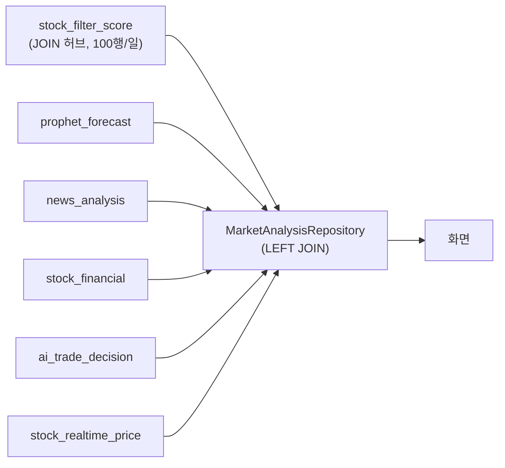
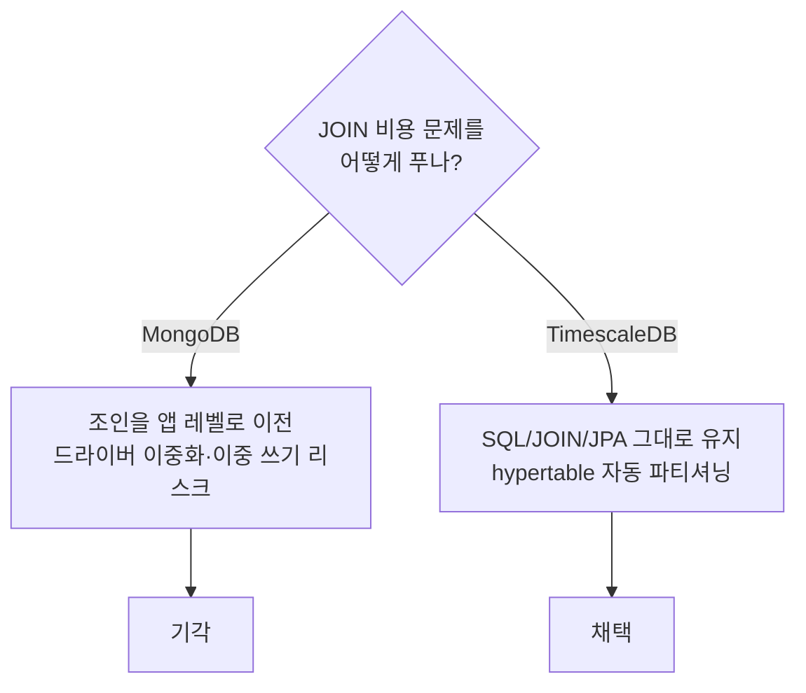

# 시계열 데이터 TimescaleDB 마이그레이션

대용량 시계열 데이터 관리 효율·성능 개선 작업의 기록. 문제, 결정, 실측 결과를 남긴다.

## 목차
- [1. 문제](#1-문제)
- [2. 대안 검토: MongoDB vs TimescaleDB](#2-대안-검토-mongodb-vs-timescaledb)
- [3. 마이그레이션 대상](#3-마이그레이션-대상)
- [4. 핵심 구현 결정](#4-핵심-구현-결정)
- [5. 검증 및 성능](#5-검증-및-성능)
- [6. 최종 결과](#6-최종-결과)
- [7. 향후 과제](#7-향후-과제)

---

## 1. 문제

`api-server`의 `MarketAnalysisRepository`는 `stock_filter_score`(KOSPI 100 전체, 100행/일)를
허브로 5개 테이블을 LEFT JOIN해 화면 데이터를 조립한다. 데이터가 몇 년치 누적되면 이 JOIN
비용이 계속 불어나는 구조다.



쿼리는 대부분 인덱스가 있는 단일 날짜 조회라 지금 당장 느리진 않지만, **테이블이 계속 커지면
심각해질 문제**라 미리 손보기로 했다.

## 2. 대안 검토: MongoDB vs TimescaleDB

기능 카드의 원안은 "NoSQL로 마이그레이션"이었다 — NoSQL이 대용량 데이터에 강하다는 통념과,
시계열 데이터 특성상 수평 확장이 유리할 거라는 판단이 근거였다.



**최종 선택: TimescaleDB.** PostgreSQL 확장이라 SQL/JOIN/JPA가 그대로 동작하고, 문제의
본질(테이블이 커질수록 조회가 느려짐)을 정확히 겨냥한 해법이면서 마이그레이션 리스크는
"테이블 선언 + `create_hypertable()` 한 줄"에 가깝다. NoSQL 전환 자체가 목적이 아니라 실제
문제 해결이 목적이었다.

## 3. 마이그레이션 대상

JOIN 허브 역할을 하는 4개 테이블을 우선 전환했다: `asset_daily_snapshot`(1차 파일럿, 조인
없어 리스크 최소), `stock_filter_score`(핵심 JOIN 허브), `prophet_forecast`, `news_analysis`.
매매 원장(`trade_history`)과 분기 갱신 테이블(`stock_financial`) 등 조인 허브가 아니거나
볼륨이 작은 테이블은 이번 스코프 밖으로 남겼다.

## 4. 핵심 구현 결정

**hypertable PK 제약**: TimescaleDB는 PK/UNIQUE 제약이 파티션 컬럼을 포함해야 해서, 4개
테이블 모두 `id` 단독 PK를 `(id, 날짜)` 복합키로 바꿨다. api-server `AssetDailySnapshot`
엔티티에는 `@IdClass`를 적용했다.

**청크 스캔 회귀 발견·수정**: 전환 후 EXPLAIN으로 확인하니, `ai-agent`의 "행을 로드해서
고치고 저장" 방식 UPDATE가 모든 chunk에 index scan을 거는 fan-out이 되어 있었다 — 마이그레이션
목적(조회 성능 개선)을 이 경로에서 정반대로 만들 수 있는 지점이었다.

```diff
- record = session.query(StockFilterScore).filter(stock_code=.., score_date=..).first()
- record.morning_return = morning_return
- session.commit()
+ session.query(StockFilterScore).filter(stock_code=.., score_date=..).update(
+     {StockFilterScore.morning_return: morning_return}, synchronize_session=False)
+ session.commit()
```

`score_date`가 WHERE에 남아 단일 chunk로 배제되도록 고쳤다.

## 5. 검증 및 성능

Testcontainers(`timescale/timescaledb:latest-pg16`)에 실제 프로덕션 Liquibase changelog를
적용해 hypertable 등록·제약·upsert·실제 3중 LEFT JOIN 쿼리·프로덕션 리포지토리 실호출까지
검증하는 17개 테스트를 작성했다. 기존 테스트(api-server 491개, ai-agent 740개) 전부 회귀 없음.

평일만·10년치·종목 1,000개(2,610,000행) 기준 실측:

| 시나리오 | 일반 테이블 | hypertable | 결과 |
|---|---|---|---|
| 점 조회 (단일 날짜) | 0.406ms | 0.096ms | **4.2배 빠름** |
| 오래된 데이터 정리 | ~5.7초 (전체 배타 락) | 202ms (락 없음) | **28배 빠르고 무중단** |
| 압축 (30일 chunk 튜닝) | 295MB | 197MB | **33% 작음** |
| 실제 range 조회 (`getHistory()`, 비집계) | 2.348ms | 2.373ms | 오차범위 내 동일 |

넓은 범위를 GROUP BY로 집계하는 쿼리는 오히려 hypertable이 느렸지만(현재 코드엔 이런 쿼리가
없음), 실제로 존재하는 모든 쿼리 패턴에서는 개선되거나 손해가 없었다.

## 6. 최종 결과

JOIN 허브 4개 테이블을 hypertable로 전환해, 테이블이 계속 커져도 현재 코드가 실제로 쓰는
조회 패턴의 성능이 유지되도록 만들었다.

- **점 조회 4배, 데이터 정리 28배(+무중단), 압축 33% 절감**을 실측으로 확인했다.
- 실제로 쓰이는 range 조회는 손해 없이 동일 — 전환이 기존 기능을 퇴행시키지 않았다.
- 전환 과정에서 청크 스캔 회귀 1건을 발견해 즉시 수정했고, 신규 테스트 17개 + 기존 1,231개
  전부 통과, 데이터 손실 없이 반영했다.

## 7. 향후 과제

- **`chunk_time_interval` 튜닝**: 기본값(7일)은 range 집계에 비효율적 — 30일 안팎으로 조정 필요.
- **retention/압축 정책 자동화**: 실측에서 가장 큰 이득이 나온 영역이라 `drop_chunks()`/
  `add_compression_policy` 기반 자동화가 다음 단계.
- **스코프 밖 테이블 재검토**: `stock_news`, `trade_history`는 조회가 느려지거나 거래 이력이
  충분히 쌓이면 후속 전환을 고려한다.
