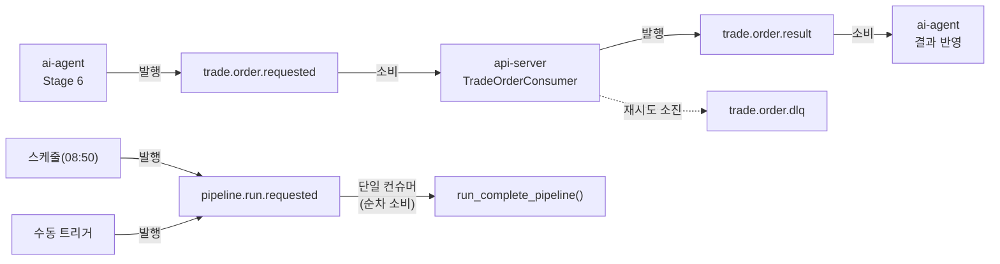
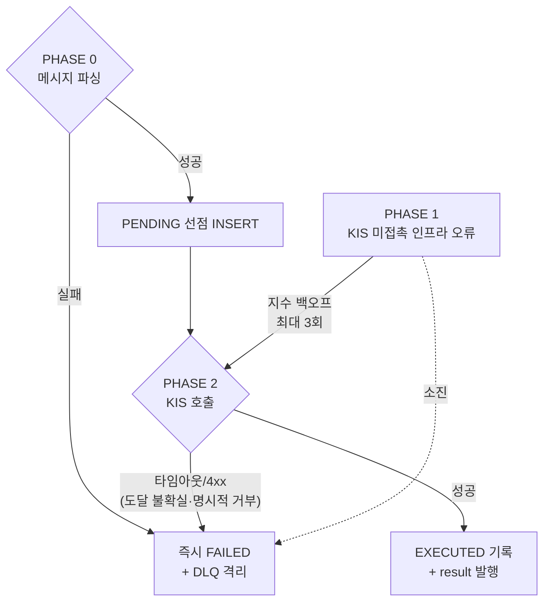
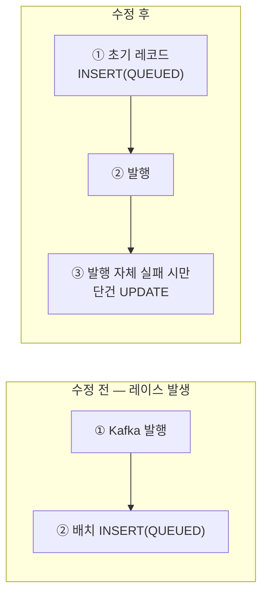

# 매매 실행 신뢰성 개선: Kafka 메시지 큐 도입

ai-agent(분석 파이프라인)와 api-server(매매 실행) 사이에 있던 두 가지 신뢰성 문제를 Kafka로
해결한 기록. 결정 근거, 핵심 구현, 실측 결과를 남긴다.

## 목차
- [1. 문제](#1-문제)
- [2. 왜 Kafka인가](#2-왜-kafka인가)
- [3. 메시지 계약 & 토폴로지](#3-메시지-계약--토폴로지)
- [4. 핵심 구현](#4-핵심-구현)
- [5. 검증 및 실측 결과](#5-검증-및-실측-결과)
- [6. 최종 결과](#6-최종-결과)
- [7. 향후 과제](#7-향후-과제)

---

## 1. 문제

**이슈 1 — 매매 주문 유실.** ai-agent Stage 6이 api-server를 동기 HTTP로 호출하는데 실패 시
재시도가 없었다. api-server가 다운되거나 KIS가 타임아웃되면 주문이 영구히 사라지고
파이프라인은 "성공"으로 마감됐다. `trade_history`에도 기록이 남지 않아 매매 감사 로그가
시스템 어디에도 없었다.

**이슈 2 — 파이프라인 동시 실행 방지 부재.** 스케줄 트리거와 수동 트리거가 동시 실행을 막는
락 없이 각각 파이프라인을 실행할 수 있어, 겹치면 동일 유저에게 중복 매수 주문이 나갈 수 있었다.

## 2. 왜 Kafka인가

두 이슈 모두 "요청과 실행을 분리하고, 실행이 실패해도 요청이 사라지지 않게 하는 것"이 본질이라
Kafka의 Producer/Consumer 모델과 맞아떨어진다. RabbitMQ·Redis Streams·SQS 대신 Kafka를 고른
이유:

- **파티션 기반 순서 보장**: 동일 키(`userId:stockCode:tradeDate:side`) 메시지가 같은
  파티션에 순서대로 쌓여 멱등성 로직이 단순해진다.
- **향후 확장 여지**: Gemini 결정 큐잉 등 이벤트 스트림을 계속 늘려나갈 걸 감안하면 생태계가
  넓은 Kafka가 유리하다.
- **낮은 도입 비용**: 이미 다뤄본 기술이라 학습 곡선 없이 바로 프로덕션 수준으로 붙일 수 있었다.

조사 후보 5개(주문 유실, 파이프라인 동시성, Gemini 큐잉, 종목 단위 재시도, Stage 체크포인트)
중 설계가 확정된 **이슈 1·2만 이번에 구현**했다 — 나머지는 처리량 이득이 없거나(종목 재시도),
선행 리팩터링이 필요하거나(Stage 체크포인트), 정책이 미확정(Gemini 큐잉)이라 제외했다. 이슈
1의 멱등키는 이슈 2의 잔여 리스크(중복 실행 시 중복 주문)까지 막아주는 안전망 역할도 한다
(5장에서 실측 확인).

## 3. 메시지 계약 & 토폴로지

api-server·ai-agent를 독립적으로 작업시키기 위해 스펙을 먼저 고정했다: 메시지 8개 필드,
멱등키는 record key와 body 양쪽에 채워 컨슈머가 어느 쪽을 읽어도 안전하게 했다.

## 4. 핵심 구현

**PENDING 선(先) claim + PHASE 기반 재시도.** KIS 호출 *전에* PENDING 행을 선점 INSERT해,
프로세스가 죽어도 재실행 흔적이 남게 했다. 재시도 여부는 "KIS를 호출했는가"로 가른다 — 이미
건드린 실패는 도달 여부가 불확실해 즉시 DLQ, 아직 안 건드린 인프라 오류만 재시도한다.

**파이프라인 직렬화**: 스케줄·수동 트리거 모두 `pipeline.run.requested`에 발행하고 단일
컨슈머가 순차 소비하도록 바꿔, 수동 트리거는 발행 직후 즉시 202를 반환한다(이전엔 전체가 끝날
때까지 동기 대기).

**발행-INSERT 순서 레이스 발견·수정**: KIS를 호출하지 않고 즉시 실패를 반환하는 초고속
경로에서, 결과가 배치 INSERT보다 먼저 도착해 이미 확정된 실패가 `QUEUED`로 덮이는 레이스가
있었다.

결과가 도착할 수 있는 시점보다 행이 항상 먼저 존재하도록 순서를 뒤집었고, 이 레이스를
재현하는 테스트 5개로 수정 전 전부 실패·수정 후 전부 통과를 확인했다.

## 5. 검증 및 실측 결과

Testcontainers로 실제 Kafka+PostgreSQL을 띄워 프로덕션 코드 경로를 검증했다: 동일 키 3회
발행에도 KIS 호출 1회(멱등성), KIS 타임아웃/4xx는 재시도 없이 즉시 DLQ, 인프라 오류만 재시도
후 DLQ. 3장 계약을 독립 구현한 두 서비스가 실제로 같은 메시지를 주고받는지도 직렬화 바이트
단위로 정적 대조해 7개 계약 항목 전부 일치를 확인했다. 회귀 없음 — api-server 491+7개,
ai-agent 740→864개 전부 통과.

| 항목 | 실측 결과 |
|---|---|
| 파이프라인 트리거 응답 시간 | 동기 대기(수십 분) → 발행 후 즉시 응답(수 ms~30ms) |
| 동시 트리거 시 최대 동시 실행 수 | 1 (반복 실측에서 한 번도 2를 넘지 않음) |
| 멱등성의 중복 실행 방지 효과 | 동일 거래일 2회 실행 → 메시지 2건 발행, 실제 KIS 호출은 1건 |

마지막 행이 2장에서 세운 설계 의도("이슈 1의 멱등키가 이슈 2의 잔여 리스크도 막아준다")가
실측으로 성립함을 보여준다.

## 6. 최종 결과

Kafka Producer/Consumer 모델로 주문 요청·파이프라인 트리거를 큐에 발행하는 구조로 바꿔, 두
신뢰성 문제를 브로커 레벨의 재시도·DLQ·직렬 소비로 해소했다.

- **주문 유실 해소**: PENDING 선점 + DB UNIQUE 이중 방어로 동일 메시지 3회 발행에도 KIS 호출
  1회만 발생.
- **파이프라인 동시 실행 방지**: 실측상 항상 순차 처리, 요청 유실 없음.
- **응답성 개선**: 트리거 응답이 수십 분 동기 대기에서 수 ms~30ms로.
- **회귀 없이 반영**: api-server·ai-agent 전체 테스트 통과 + 독립 구현된 메시지 계약 7개
  항목 전부 일치.

## 7. 향후 과제

- **outbox 패턴 부재**: 결과 발행이 `trade_history` 원장 기록과 원자적이지 않다. 지금은
  실용적 타협이지만 트래픽이 늘면 재검토 대상.
- **운영 관측성 부재**: PENDING/QUEUED 잔여 행이나 DLQ 격리 메시지를 사람이 확인할 알람·도구가
  아직 없다.
- **실 인프라 end-to-end 미검증**: 두 서비스를 하나의 브로커에 동시에 붙여 실행하는
  end-to-end 테스트, 실 KIS 계좌 크레덴셜 동작은 아직 검증하지 않았다.
