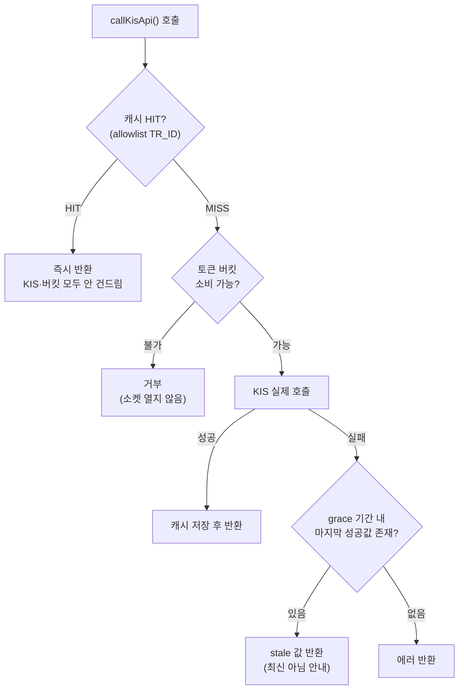
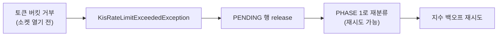

# 외부 API 의존성 격리: Redis 기반 Rate Limit·캐싱 도입

KIS(한국투자증권) Open API 호출에 상한이 없고 종목 상세 조회에 캐싱이 없던 문제를 Redis 기반
토큰 버킷(Token Bucket)과 응답 캐시로 해결한 기록. 설계 결정과 그 근거, 검증 방법과 실측
결과를 남긴다.

## 목차
- [1. 문제 정의](#1-문제-정의)
- [2. 왜 Redis 토큰 버킷 + 캐싱인가](#2-왜-redis-토큰-버킷--캐싱인가)
- [3. 설계](#3-설계)
- [4. 구현](#4-구현)
- [5. 검증](#5-검증)
- [6. 실측 결과](#6-실측-결과)
- [7. 최종 결과](#7-최종-결과)
- [8. 향후 과제](#8-향후-과제)

---

## 1. 문제 정의

api-server의 `KisApiClient`는 KIS 조회·주문 호출부 15곳 이상이 거쳐가는 단일 관문인데
(OAuth 토큰 발급은 각 서비스가 자체 `RestTemplate`으로 별도 호출하며 이 관문 밖에 있다),
여기에 rate limit이 전혀 없었다. 특히 두 경로가 위험했다.

**종목 상세 조회 — 캐싱 없음.** `CompanyInfoService`/`KisQuoteClient`가 종목 상세 화면(가격,
재무제표)을 위해 KIS 시세 2종·재무 3종을 매 요청마다 새로 호출했다. 이 경로는 유저별 키가 아닌
**앱 단위 공유 quote 키**(`KisQuoteService`, 유저마다 다른 `user_kis_accounts`와 무관)를 쓰기
때문에, 서로 다른 유저가 같은 종목을 봐도 매번 KIS를 다시 때린다 — 유저 수가 늘수록 이 단일
공유 키가 가장 먼저 rate limit에 걸리는 지점이었다.

**매매 실행 — rate limit 초과가 재시도 없이 유실.** `TradingService.executeBuy/executeSell`은
`user_kis_accounts` 기준 유저별 키를 쓰지만, 이 호출이 KIS 자체 rate limit에 걸려 거부되면
기존 Kafka 컨슈머(`TradeOrderConsumer`)의 재시도 정책상 "KIS 호출 단계에서 난 실패"로 분류돼
재시도 없이 즉시 DLQ로 격리될 위험이 있었다. 순간적인 호출 폭주 때문에 유효한 주문이 영구
유실될 수 있는 구조였다.

## 2. 왜 Redis 토큰 버킷 + 캐싱인가

두 문제는 원인이 같다 — "외부 API 호출량을 서비스가 스스로 통제하지 않는다." 해법도 하나로
묶인다: 호출 전에 상한을 걸어 넘치는 호출 자체를 막고(rate limit), 반복 조회는 애초에 KIS까지
가지 않게 한다(캐싱).

in-process 카운터가 아니라 **Redis**를 택한 이유는 두 가지다. 첫째, api-server가 여러
인스턴스로 뜨더라도(현재는 단일 인스턴스지만 유저 증가에 대비한 설계 방향) 버킷 상태가
공유돼야 한도가 실제로 지켜진다. 둘째, 캐시도 프로세스 재시작에 영향받지 않고 인스턴스 간
공유돼야 절감 효과가 온전하다. ai-agent(`kis_client.py`)는 단일 프로세스·단일 공유 계정으로
이미 `asyncio.Semaphore(5)`를 in-process로 쓰고 있어 이번 스코프에서는 손대지 않았다 — Redis로
바꿔도 지금 얻는 이득이 없다.

## 3. 설계

### 3.1 게이트 위치 — `KisApiClient.callKisApi()` 한 곳

KIS 조회·주문 호출부 15곳 넘는 곳이 전부 이 메서드로 수렴한다(OAuth 토큰 발급 4곳은 예외 —
아래 향후 과제 참고). 서비스 계층마다 개별적으로 붙이면 새 호출부가 생길 때마다 적용을 잊고
한도가 새는데, 관문에 두면 그 실패 모드가 구조적으로 사라진다.

### 3.2 캐시는 allowlist 방식

관문이 공통이라는 것은 잔고·주문가능금액·체결내역 조회도 이 메서드를 지난다는 뜻이다. 아무거나
캐시하면 매매 판단이 낡은 값으로 이뤄질 수 있다. 그래서 캐시 대상을 명시적으로 열거했다:

| TR_ID | 용도 | TTL |
|---|---|---|
| `FHKST01010100` | 현재가 | 30초 |
| `FHKST01010200` | 호가 | 30초 |
| `FHKST66430200` | 손익계산서 | 24시간 |
| `FHKST66430300` | 재무비율 | 24시간 |
| `FHKST66430600` | 안정성비율 | 24시간 |

**GET만** 대상이다. 주문/취소 같은 POST를 캐시하면 "주문이 나간 것처럼 보이지만 실제로는 안
나간" 상태가 만들어지므로 원천적으로 제외했다.

### 3.3 버킷 키 — userId가 아니라 appKey 유도

당초 유저별 매매 키는 `ratelimit:kis:user:{userId}`로 분리할 계획이었으나, 구현 과정에서
`ratelimit:kis:appkey:{sha256(appKey)[:16]}`로 바꿨다. KIS의 실제 호출 한도는 앱키 단위로
걸리므로, appKey로 유도한 버킷이 KIS가 실제로 세는 단위와 정확히 일치한다. 부가 이점으로
`callKisApi`가 이미 인자로 받는 `appKey`를 그대로 쓸 수 있어 15곳 넘는 호출부의 시그니처를
바꿀 필요가 없었다. 자격증명 원문은 Redis 키에 남기지 않고 SHA-256 해시만 사용한다. 공유
quote 키와 유저별 매매 키는 서로 다른 appKey이므로 자동으로 독립된 버킷이 된다.

### 3.4 Rate limit 거부와 매매 재시도 정책의 통합

기존 `TradeOrderConsumer`는 "KIS 호출 단계(phase)"를 기준으로 재시도 가능 여부를 가른다 —
KIS를 실제로 건드린 뒤의 실패(PHASE 2)는 도달 여부가 불확실하므로 재시도하지 않고 즉시 DLQ로
보낸다. rate limit 거부는 이 규칙의 유일한 예외다: 토큰 버킷이 **소켓을 열기 전에** 거부하므로
"KIS 미접촉"이 항상 보장된다.

`KisRateLimitExceededException`을 전용 타입으로 만들어 컨슈머가 이 경우만 PHASE 1(재시도
가능)로 되돌리도록 했다. 이때 선점해둔 PENDING 행을 먼저 반납(`release`)해야 한다 — 남겨두면
재전달된 메시지가 그 PENDING을 "도달 여부 불확실"로 오인해 똑같이 즉시 DLQ로 보내버리기
때문이다.

### 3.5 장애 시 동작 — fail-open과 stale-if-error

Redis 자체가 죽으면 rate limit과 캐시 모두 조용히 우회한다(통과/미적용). rate limit은 KIS를
보호하는 부가 장치일 뿐 서비스의 필수 경로가 아니므로, fail-close로 막으면 Redis 장애가 곧
전체 매매·조회 중단이 되어 막으려던 문제보다 더 큰 사고가 된다. 캐시 쪽은 반대로 **적극
활용**한다 — TTL이 지났거나 KIS 호출이 실패해도 grace 기간(시세 24시간, 재무 7일) 안의 마지막
성공값이 있으면 "최신 아님" 안내와 함께 계속 보여준다(stale-if-error). 기존 degrade 관례
(`notice` 필드로 미연동 사유 노출)를 그대로 확장해, "값이 없음"과 "값은 있지만 최신이 아님"을
서로 다른 문구로 구분했다.

## 4. 구현

`KisRateLimiter`(Redis Lua 스크립트 기반 원자적 토큰 버킷)와 `KisResponseCache`(캐시 조회 +
grace 폴백)를 신설하고, `KisApiClient.callKisApi()`에서 둘을 위 순서(캐시→버킷→호출)로
엮었다. 캐시 상태는 반환 타입을 바꾸지 않고 `X-Kis-Cache: HIT|STALE` 응답 헤더로 실어보내는
방식을 택해 — 기존 15곳 넘는 호출부와 테스트가 그대로 컴파일된다. `TradeOrderConsumer`는 새
예외 타입에 대한 catch 블록 하나만 추가했고, 기존 PHASE 0/1/2 판단 로직 자체는 건드리지
않았다. `TradeOrderIdempotencyService`에는 PENDING 상태인 행만 지우는 `release()`를
추가했다 — 이미 KIS를 호출해 EXECUTED/FAILED로 확정된 행을 지우면 "이 주문이 나갔을 수 있다"는
유일한 흔적이 사라져 재시도가 곧 중복 주문이 되므로, 대상을 PENDING으로 엄격히 제한했다.

인프라는 `docker-compose.yml`에 `redis:7-alpine`(헬스체크 포함)을 추가하고 api-server의
`depends_on`에 연결했다. rate limit 용량/충전률, 캐시 TTL/grace 기간은 전부
`kis.resilience.*` 설정으로 뺐다.

## 5. 검증

Testcontainers로 실제 Redis 컨테이너를 띄워 프로덕션 코드 경로(`KisApiClient`,
`KisQuoteClient`, `CompanyInfoService`, `TradeOrderConsumer`)를 그대로 검증했다. KIS로 나가는
HTTP 전송 계층을 단순 목이 아니라 **호출 횟수를 세는** `ClientHttpRequestFactory` 구현으로
바꿔치기했다 — "거부된 호출은 실제로 KIS에 닿지 않았다", "TTL 안 반복 조회는 KIS를 1번만
불렀다"는 명제는 응답값만으로는 증명할 수 없고 호출 카운터로 직접 세야 하기 때문이다.

| 항목 | 검증 방법 | 결과 |
|---|---|---|
| 한도 내 통과 / 초과 거부 | 15회 연속 시도, KIS 호출 카운터 대조 | 거부분은 KIS 호출 0회로 직접 확인 |
| 버킷 리필 | 1.2초 대기 후 재시도 | 성공 |
| 공유 quote 버킷 ↔ 유저별 매매 버킷 독립성 | 한쪽 완전 소진 상태에서 다른 쪽 호출 | 영향 없이 정상 통과 |
| 매매 경로 미캐시 | 잔고 조회(allowlist 밖) 2회 호출 | KIS로 2회 모두 나감 |
| 캐시 히트 | 동일 종목 TTL 내 반복 조회 | KIS 호출 1회로 수렴 |
| stale-if-error | TTL 만료 + KIS 503 주입 | 마지막 성공값 + `stale=true` 반환 |
| Kafka PHASE 분류 정합성 | rate limit 거부 후 버킷 회복 시 자동 재시도 성공 | DLQ 없이 정상 체결 |
| Kafka PHASE 분류 정합성 (소진) | rate limit 지속 시 재시도 소진 | DLQ 격리 + `retryCount: 3`, PENDING 잔여 0건 |

**mutation 테스트**: `TradeOrderConsumer`의 rate-limit 전용 catch 블록을 의도적으로 제거하고
재실행한 결과, 위 표의 마지막 두 케이스가 정확히 "PHASE 2 오분류로 즉시 DLQ, `retryCount: 0`"
형태로 실패했다 — 이 보호가 실제로 유실을 막고 있음을 실증했다.

**실행 결과**: 신규 `redisTest` 12개, 기존 `kafkaTest`에 rate limit 케이스 2개 추가(총 9개),
모두 통과. 기존 회귀 `test` 태스크 **491개 전부 통과**(재실행으로 직접 확인, 캐시된 결과 아님).

## 6. 실측 결과

### 6.1 캐시 절감율

| 시나리오 | 캐시 없음 | 캐시 적용 | 절감율 |
|---|---|---|---|
| 동일 종목 현재가 100회 조회(TTL 내) | 100회 | 1회 | 99.0% |
| 종목 상세 30명 조회(기본정보+재무제표) | 150회 | 4회 | 97.3% |
| 재무 3종+시세, 2회차 조회 | 4회 | 0회 | 100% |

종목당 고유 데이터는 4종(현재가+재무 3종)뿐이라, 조회자 수와 무관하게 KIS 호출이 **4회로
수렴**한다. 이 경로가 공유 quote 앱키를 쓰기 때문에, 유저 수에 선형으로 늘던 호출량이 상수로
바뀐 것이 이번 작업의 핵심 성과다.

### 6.2 rate limit 차단

용량 5·초당 충전 5 기준, 15회 연속 시도 시 통과 5~6회·거부 9~10회. 거부된 호출은 KIS 호출
카운터가 그대로 증가하지 않아 소켓조차 열리지 않았음을 직접 확인했다.

## 7. 최종 결과

단일 관문(`KisApiClient.callKisApi()`)에 앱키 단위 토큰 버킷과 allowlist 캐시를 얹어, KIS
호출량을 유저 수와 무관하게 통제할 수 있는 구조로 바꿨다. 두 문제(캐싱 없는 종목 상세 조회,
rate limit 초과 시 주문 유실 위험)를 하나의 게이트로 함께 해소했다.

- **종목 상세 조회 호출량이 조회자 수와 무관해졌다**: 30명이 같은 종목을 봐도 KIS 호출은
  4회로 수렴한다(97.3% 절감) — 유저 수에 선형으로 늘던 호출량이 상수가 됐다.
- **KIS 호출에 실제 상한이 생겼다**: 초과분은 소켓을 열지 않고 거부되는 걸 호출 카운터로
  직접 확인했다(15회 시도 중 9~10회 거부, 거부분 KIS 호출 0회). 공유 quote 버킷과 유저별
  매매 버킷이 독립이라 시세 폭주가 매매를 굶기지 않는다.
- **rate limit 거부로 인한 매매 주문 유실을 막았다**: Kafka 컨슈머가 이 거부만 재시도 가능
  경로로 되돌리도록 예외 타입을 분리했고, 이 catch 블록을 의도적으로 제거하는 mutation
  테스트로 "빼면 실제로 깨진다"는 것까지 확인했다.
- **KIS 장애 시에도 화면이 비지 않는다**: grace 기간 내 마지막 성공값을 "최신 아님" 안내와
  함께 보여준다(stale-if-error).
- **회귀 없이 반영**: 기존 491개 테스트 전부 통과, 신규 21개(kafkaTest +2, redisTest 12)
  추가.

## 8. 향후 과제

- **설정값의 실증 근거 부재**: rate limit 기본값(5 tokens/sec)은 KIS 공식 수치가 아니라
  ai-agent의 `Semaphore(5)` 관례에 맞춘 추정치이고, 캐시 TTL(시세 30초·재무 24시간)도 상식적
  판단이다. 실제 한도 확인과 사용자 체감 기준 검증이 필요하다.
- **ai-agent와의 버킷 미통합**: 같은 앱키를 쓰는 별도 프로세스가 늘어나면 합산 한도를 초과할
  수 있다.
- **다중 인스턴스 동시성 부하 미검증**: Lua 스크립트로 원자성은 보장되나, 실제 병렬 인스턴스
  환경에서의 부하 테스트는 하지 않았다.
- **운영 관측성 부재**: rate limit 거부율·캐시 적중률이 로그로만 남고 메트릭으로 노출되지
  않는다. 노출되면 이후 KIS의 실제 429 응답을 관측해 버킷을 동적으로 조정하는 적응형 rate
  limit도 검토할 수 있다.
- **OAuth 토큰 발급 경로가 관문 밖에 있다**: `KisAuthService`/`KisQuoteService`/`AuthService`/
  `KisApprovalKeyProvider` 4곳이 `/oauth2/tokenP`·`/oauth2/Approval`을 각자 `RestTemplate`으로
  직접 호출해 토큰 버킷을 소비하지 않는다. KIS의 실제 호출 한도는 앱키 단위로 OAuth 발급도
  포함하므로 버킷이 세는 양과 KIS가 세는 양이 어긋난다. 특히 `AuthService`(유저의 KIS 키
  등록/검증)는 캐시 없이 사용자 액션마다 호출된다. 실사용자가 소수인 현재는 실질 위험이
  낮지만, 관문을 확장하거나 이 경로에도 별도 버킷을 두는 방향을 검토할 필요가 있다.
