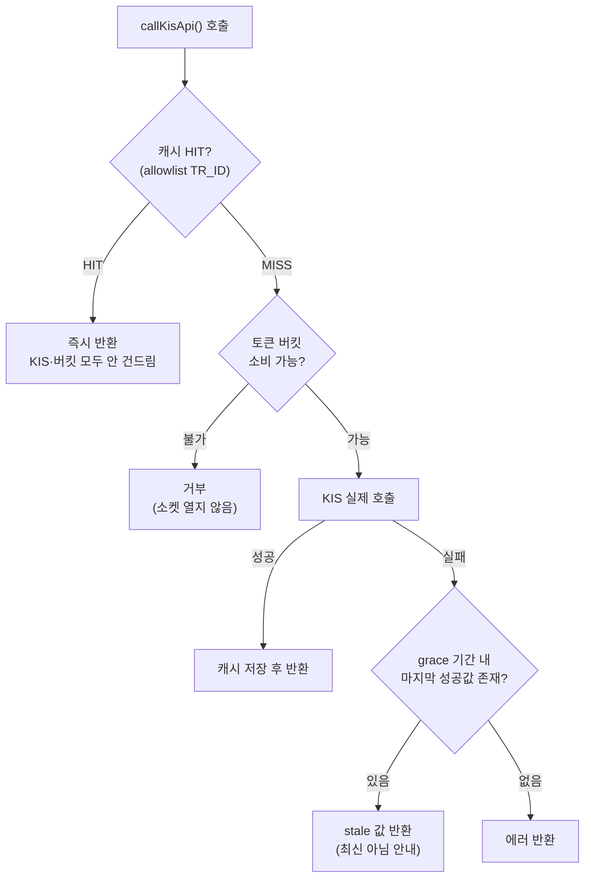
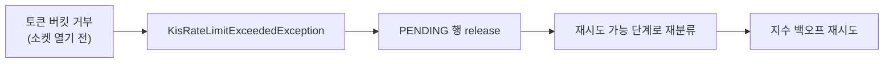

# 외부 API 의존성 격리: Redis 기반 Rate Limit·캐싱 도입

KIS(한국투자증권) Open API 호출에 상한이 없고 종목 상세 조회에 캐싱이 없던 문제를 Redis 기반
토큰 버킷과 응답 캐시로 해결한 기록.

## 목차
- [1. 문제](#1-문제)
- [2. 왜 Redis 토큰 버킷 + 캐싱인가](#2-왜-redis-토큰-버킷--캐싱인가)
- [3. 핵심 설계](#3-핵심-설계)
- [4. 검증 및 실측 결과](#4-검증-및-실측-결과)
- [5. 최종 결과](#5-최종-결과)
- [6. 향후 과제](#6-향후-과제)

---

## 1. 문제

api-server의 `KisApiClient`는 KIS 호출부 15곳 이상이 거쳐가는 단일 관문인데(OAuth 토큰 발급
4곳은 이 관문 밖에서 각자 호출한다), rate limit이 전혀 없었다. 두 경로가 위험했다:

- **종목 상세 조회**: 앱 단위 공유 quote 키를 쓰기 때문에, 다른 유저가 같은 종목을 봐도 매번
  KIS를 다시 호출한다 — 유저 수가 늘수록 가장 먼저 rate limit에 걸리는 지점.
- **매매 실행**: rate limit 초과로 거부되면 기존 Kafka 컨슈머가 "KIS 호출 단계 실패"로
  분류해 재시도 없이 즉시 DLQ로 보낸다 — 순간적인 호출 폭주로 유효한 주문이 영구 유실될 수
  있는 구조였다.

## 2. 왜 Redis 토큰 버킷 + 캐싱인가

두 문제는 원인이 같다 — "외부 API 호출량을 서비스가 스스로 통제하지 않는다." in-process
카운터가 아니라 **Redis**를 택한 이유는, api-server가 여러 인스턴스로 뜨더라도(현재는
단일이지만 유저 증가 대비 설계 방향) 버킷·캐시 상태가 공유돼야 한도와 절감 효과가 실제로
지켜지기 때문이다. ai-agent는 단일 프로세스·단일 공유 계정으로 이미 in-process
`asyncio.Semaphore(5)`를 쓰고 있어 이번 스코프에서는 손대지 않았다.

## 3. 핵심 설계

**게이트 위치 — `KisApiClient.callKisApi()` 한 곳.** 서비스마다 개별 적용하면 새 호출부가
생길 때마다 한도가 새는데, 관문에 두면 그 실패 모드가 구조적으로 사라진다.

**캐시는 allowlist 방식**이다. GET만, TR_ID 5종만(현재가·호가 30초, 재무 3종 24시간) 대상으로
명시적으로 열거했다 — 관문이 공통이라 잔고·주문가능금액 같은 매매 판단 경로도 지나가기 때문에,
아무거나 캐시하면 낡은 값으로 매매 판단이 이뤄질 위험이 있다.

**버킷 키는 appKey 유도**(`ratelimit:kis:appkey:{sha256(appKey)[:16]}`)다. KIS의 실제 호출
한도가 앱키 단위이므로, 이 버킷이 KIS가 세는 단위와 정확히 일치하고 공유 quote 키·유저별
매매 키가 자동으로 독립된 버킷이 된다.

**rate limit 거부는 Kafka 재시도 규칙의 유일한 예외**다. 토큰 버킷은 소켓을 열기 전에
거부하므로 "KIS 미접촉"이 항상 보장돼, 전용 예외 타입으로 이 경우만 재시도 가능한 단계로
되돌린다.

**장애 시**: Redis가 죽으면 rate limit·캐시 모두 fail-open(통과)한다 — rate limit은 KIS
보호용 부가 장치일 뿐이라 fail-close로 막으면 Redis 장애가 곧 전체 매매·조회 중단이라는 더 큰
사고가 된다. 캐시는 반대로 stale-if-error로 적극 활용해, grace 기간 내 마지막 성공값을
"최신 아님" 안내와 함께 계속 보여준다.

## 4. 검증 및 실측 결과

Testcontainers로 실제 Redis를 띄우고, KIS로 나가는 HTTP 전송 계층을 호출 횟수를 세는
구현으로 바꿔치기해 "거부된 호출은 실제로 KIS에 닿지 않았다"를 직접 증명했다. rate-limit 전용
catch 블록을 의도적으로 제거하는 mutation 테스트로 이 보호가 실제로 동작함도 실증했다. 신규
21개(redisTest 12 + kafkaTest 2) 전부 통과, 기존 491개 회귀 없음.

| 시나리오 | 결과 |
|---|---|
| 종목 상세 30명 조회 | 150회 → 4회 (97.3% 절감, 조회자 수와 무관해짐) |
| rate limit 차단 (도입 당시 용량 5·초당 충전 5) | 15회 시도 중 9~10회 거부, 거부분 KIS 호출 0회 |

> **현재 설정은 용량 10·초당 충전 5다**(`application.yml`의 `KIS_RATE_LIMIT_CAPACITY:10` / `KIS_RATE_LIMIT_REFILL:5`). 위 실험 수치는 용량 5 기준이라 지금 그대로 재현되지 않는다(용량이 늘어난 만큼 거부 수가 줄어든다). 용량을 충전 속도의 2배로 둔 이유는 종목 상세 재무 탭이 한 번에 4연속 호출을 내기 때문이다 — 버스트를 흡수하지 못하면 정상 화면 진입이 자기 자신의 rate limit에 걸린다.

## 5. 최종 결과

단일 관문에 앱키 단위 토큰 버킷과 allowlist 캐시를 얹어, KIS 호출량을 유저 수와 무관하게
통제할 수 있는 구조로 바꿨다.

- **종목 상세 조회 호출량이 조회자 수와 무관해졌다**: 유저 수에 선형으로 늘던 호출량이 4회로
  수렴하는 상수가 됐다(97.3% 절감).
- **KIS 호출에 실제 상한이 생겼다**: 초과분은 소켓조차 열지 않고 거부됨을 호출 카운터로
  직접 확인했다.
- **rate limit 거부로 인한 매매 주문 유실을 막았다**: 이 거부만 재시도 가능 경로로
  되돌리도록 예외 타입을 분리하고, mutation 테스트로 "빼면 실제로 깨진다"까지 확인했다.
- **회귀 없이 반영**: 기존 491개 전부 통과, 신규 21개 추가.

## 6. 향후 과제

- **설정값의 실증 근거 부재**: rate limit 기본값·캐시 TTL 모두 KIS 공식 수치가 아니라
  추정치다. 실제 한도 확인과 사용자 체감 기준 검증이 필요하다.
- **ai-agent와의 버킷 미통합**: 같은 앱키를 쓰는 별도 프로세스가 늘어나면 합산 한도를
  초과할 수 있다.
- **운영 관측성 부재**: rate limit 거부율·캐시 적중률이 로그로만 남고 메트릭으로 노출되지
  않는다.
- **OAuth 토큰 발급 경로가 관문 밖에 있다**: 4곳이 각자 `RestTemplate`으로 직접 호출해 토큰
  버킷을 소비하지 않는다. 실사용자가 소수인 현재는 위험이 낮지만, 이 경로에도 버킷을 두는
  방향을 검토할 필요가 있다.
