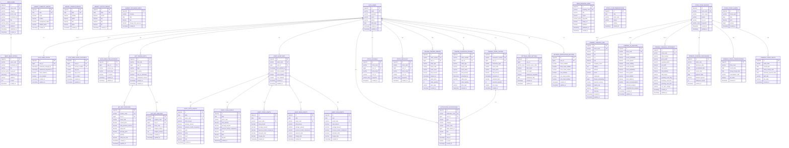

```mermaid
erDiagram
    %% ============================================================
    %% AUTH SCHEMA - 인증/계정
    %% ============================================================
    
    AUTH_USERS {
        bigserial id PK
        varchar email UK
        varchar password
        varchar name
        varchar phone
        date birth_date
        timestamp created_at
        timestamp updated_at
    }
    
    AUTH_USER_STATUS {
        bigserial id PK
        bigint user_id FK
        timestamp password_changed_at
        timestamp withdrawal_requested_at
        boolean stock_enabled
        boolean coin_enabled
        timestamp created_at
        timestamp updated_at
    }
    
    AUTH_USER_STOCK_ACCOUNTS {
        bigserial id PK
        bigint user_id FK
        varchar account_number UK
        varchar app_key
        varchar app_secret
        boolean is_verified
        timestamp created_at
        timestamp updated_at
    }
    
    AUTH_USER_COIN_ACCOUNTS {
        bigserial id PK
        bigint user_id FK
        varchar access_key
        varchar secret_key
        boolean is_verified
        timestamp created_at
        timestamp updated_at
    }
    
    %% ============================================================
    %% BOT SCHEMA - 투자봇
    %% ============================================================
    
    BOT_TRADING_BOTS {
        bigserial id PK
        varchar bot_code UK
        bigint user_id FK
        varchar type
        boolean is_active
        boolean sell_on_deactivate
        decimal investment_amount
        timestamp created_at
        timestamp updated_at
    }
    
    BOT_BOT_POSITIONS {
        bigserial id PK
        varchar position_code UK
        bigint bot_id FK
        varchar stock_code
        decimal current_price
        decimal total_purchase_amount
        decimal profit_loss
        decimal average_price
        int quantity
        decimal profit_loss_rate
        timestamp created_at
        timestamp updated_at
    }
    
    BOT_BOT_ANALYSES {
        bigserial id PK
        varchar analysis_code UK
        bigint bot_id FK
        varchar stock_code
        varchar analysis_subject
        text analysis_content
        timestamp created_at
        timestamp updated_at
    }
    
    %% ============================================================
    %% ASSET SCHEMA - 자산
    %% ============================================================
    
    ASSET_ASSET_INFO {
        bigserial id PK
        varchar asset_code UK
        bigint user_id FK
        timestamp last_updated_at
        boolean stock_enabled
        boolean bond_enabled
        boolean coin_enabled
        timestamp created_at
        timestamp updated_at
    }
    
    ASSET_TOTAL_ASSETS {
        bigserial id PK
        date date
        varchar asset_code FK
        decimal total_amount
        decimal average_amount
        decimal previous_month_comparison
        decimal cash
        decimal stock
        decimal bond
        decimal coin
        timestamp created_at
    }
    
    ASSET_CASH_ASSETS {
        bigserial id PK
        date date
        varchar asset_code FK
        decimal total_amount
        decimal average_amount
        decimal previous_month_comparison
        decimal cash
        decimal debt
        decimal deposit
        timestamp created_at
    }
    
    ASSET_STOCK_ASSETS {
        bigserial id PK
        date date
        varchar asset_code FK
        decimal total_amount
        decimal average_amount
        decimal previous_month_comparison
        decimal domestic_total
        decimal foreign_total
        timestamp created_at
    }
    
    ASSET_BOND_ASSETS {
        bigserial id PK
        date date
        varchar asset_code FK
        decimal total_amount
        decimal average_amount
        decimal previous_month_comparison
        decimal domestic_total
        decimal foreign_total
        timestamp created_at
    }
    
    ASSET_COIN_ASSETS {
        bigserial id PK
        date date
        varchar asset_code FK
        decimal total_amount
        decimal average_amount
        decimal previous_month_comparison
        decimal domestic_total
        decimal foreign_total
        timestamp created_at
    }
    
    %% ============================================================
    %% NOTIFICATION SCHEMA - 알림
    %% ============================================================
    
    NOTIFICATION_NOTIFICATIONS {
        bigserial id PK
        varchar notification_code UK
        bigint user_id FK
        varchar type
        varchar category
        varchar stock_code
        bigint trade_history_id
        varchar title
        text content
        timestamp sent_at
        boolean is_read
        timestamp created_at
    }
    
    %% ============================================================
    %% MARKET SCHEMA - 시장 정보
    %% ============================================================
    
    MARKET_DOMESTIC_INDICES {
        bigserial id PK
        date date UK
        decimal kospi
        decimal kosdaq
        decimal employment_index
        decimal inflation_index
        timestamp created_at
    }
    
    MARKET_FOREIGN_INDICES {
        bigserial id PK
        date date UK
        decimal nasdaq
        decimal sp500
        decimal dow
        decimal nikkei
        timestamp created_at
    }
    
    MARKET_CRYPTO_INDICES {
        bigserial id PK
        date date UK
        decimal cmi10
        decimal bdi
        decimal dpi
        decimal fdi
        timestamp created_at
    }
    
    MARKET_EXCHANGE_RATES {
        bigserial id PK
        varchar currency
        date date
        decimal rate
        decimal change_from_previous
        timestamp created_at
    }
    
    %% ============================================================
    %% NEWS SCHEMA - 뉴스
    %% ============================================================
    
    NEWS_NEWS {
        bigserial id PK
        varchar news_code UK
        varchar category
        varchar stock_code
        varchar thumbnail_url
        varchar title
        varchar_array keywords
        varchar publisher
        timestamp published_at
        timestamp created_at
    }
    
    NEWS_NEWS_DETAILS {
        bigserial id PK
        varchar news_code UK
        varchar thumbnail_url
        varchar title
        varchar_array keywords
        timestamp published_at
        varchar publisher
        text content
        timestamp created_at
    }
    
    NEWS_BREAKING_NEWS {
        bigserial id PK
        varchar breaking_code UK
        varchar title
        varchar region
        varchar_array keywords
        varchar image_url
        varchar publisher
        timestamp published_at
        timestamp created_at
    }
    
    %% ============================================================
    %% STOCK SCHEMA - 종목
    %% ============================================================
    
    STOCK_AI_RECOMMENDATIONS {
        bigserial id PK
        date date
        varchar stock_code
        varchar market
        int ranking
        timestamp created_at
    }
    
    STOCK_HOLDINGS {
        bigserial id PK
        varchar stock_code
        bigint user_id FK
        varchar stock_name
        varchar icon_url
        varchar_array keywords
        timestamp created_at
    }
    
    STOCK_WATCHLIST {
        bigserial id PK
        varchar stock_code
        bigint user_id FK
        varchar stock_name
        varchar icon_url
        varchar_array keywords
        timestamp created_at
    }
    
    STOCK_STOCK_MASTER {
        bigserial id PK
        varchar stock_code UK
        varchar stock_name
        varchar market
        varchar icon_url
        varchar_array keywords
        timestamp created_at
        timestamp updated_at
    }
    
    STOCK_STOCK_CHARTS {
        bigserial id PK
        varchar stock_code
        date date
        decimal price
        bigint volume
        timestamp created_at
    }
    
    %% ============================================================
    %% TRADING SCHEMA - 거래
    %% ============================================================
    
    TRADING_PENDING_ORDERS {
        bigserial id PK
        varchar order_number UK
        bigint user_id FK
        varchar order_type
        varchar stock_code
        varchar stock_name
        decimal total_amount
        timestamp ordered_at
        decimal order_price
        int order_quantity
        varchar price_type
        timestamp created_at
    }
    
    TRADING_SCHEDULED_ORDERS {
        bigserial id PK
        varchar order_number UK
        bigint user_id FK
        varchar order_type
        varchar stock_code
        varchar stock_name
        decimal total_amount
        timestamp scheduled_at
        decimal order_price
        int order_quantity
        varchar price_type
        timestamp created_at
    }
    
    TRADING_TRADE_HISTORY {
        bigserial id PK
        varchar transaction_number UK
        bigint user_id FK
        varchar transaction_type
        varchar stock_code
        varchar stock_name
        decimal total_amount
        timestamp executed_at
        decimal executed_price
        int executed_quantity
        varchar price_type
        timestamp created_at
    }
    
    %% ============================================================
    %% SETTINGS SCHEMA - 설정
    %% ============================================================
    
    SETTINGS_USER_SETTINGS {
        bigserial id PK
        bigint user_id FK
        varchar_array favorite_asset_order
        boolean dark_mode
        boolean auto_login
        boolean withdrawal_requested
        date withdrawal_date
        timestamp created_at
        timestamp updated_at
    }
    
    SETTINGS_NOTIFICATION_SETTINGS {
        bigserial id PK
        bigint user_id FK
        boolean stock_enabled
        boolean stock_news_enabled
        boolean stock_trade_enabled
        boolean coin_enabled
        boolean coin_news_enabled
        boolean coin_trade_enabled
        timestamp created_at
        timestamp updated_at
    }
    
    %% ============================================================
    %% COMPANY SCHEMA - 기업 상세
    %% ============================================================
    
    COMPANY_COMPANY_INFO {
        bigserial id PK
        varchar stock_code UK
        decimal per
        decimal pbr
        decimal roe
        decimal eps
        varchar company_name
        text address
        varchar website
        varchar sector
        int employees
        bigint shares_outstanding
        varchar financial_currency
        decimal market_cap
        decimal dividend
        text overview
        timestamp created_at
        timestamp updated_at
    }
    
    COMPANY_AI_ANALYSES {
        bigserial id PK
        varchar stock_code UK
        varchar sector
        decimal sector_profitability
        decimal sector_growth
        decimal sector_stability
        decimal sector_dividend
        decimal stock_profitability
        decimal stock_growth
        decimal stock_stability
        decimal stock_dividend
        decimal trade_recommendation
        text technical_analysis
        text comprehensive_analysis
        timestamp created_at
        timestamp updated_at
    }
    
    COMPANY_FINANCIAL_STATEMENTS {
        bigserial id PK
        varchar stock_code UK
        decimal total_revenue
        decimal gross_profit
        decimal operating_profit
        decimal net_profit
        decimal total_assets
        decimal total_liabilities
        decimal total_equity
        decimal operating_cash_flow
        decimal investing_cash_flow
        decimal financing_cash_flow
        decimal net_cash_change
        timestamp created_at
        timestamp updated_at
    }
    
    COMPANY_DIVIDEND_DISCLOSURES {
        bigserial id PK
        varchar stock_code
        date disclosure_date
        date ex_dividend_date
        date record_date
        date payment_date
        decimal dividend_amount
        int settlement_month
        timestamp created_at
    }
    
    COMPANY_STOCK_CONSOLIDATIONS {
        bigserial id PK
        varchar stock_code
        date record_date
        date listing_change_date
        varchar consolidation_ratio
        decimal par_value
        timestamp created_at
    }
    
    COMPANY_STOCK_SPLITS {
        bigserial id PK
        varchar stock_code
        date record_date
        date listing_change_date
        date fractional_payment_date
        varchar split_ratio
        decimal par_value
        timestamp created_at
    }
    
    %% ============================================================
    %% RELATIONSHIPS
    %% ============================================================
    
    %% AUTH 관계
    AUTH_USERS ||--|| AUTH_USER_STATUS : "1:1"
    AUTH_USERS ||--o| AUTH_USER_STOCK_ACCOUNTS : "1:0..1"
    AUTH_USERS ||--o| AUTH_USER_COIN_ACCOUNTS : "1:0..1"
    
    %% BOT 관계
    AUTH_USERS ||--o{ BOT_TRADING_BOTS : "1:N"
    BOT_TRADING_BOTS ||--o{ BOT_BOT_POSITIONS : "1:N"
    BOT_TRADING_BOTS ||--o{ BOT_BOT_ANALYSES : "1:N"
    
    %% ASSET 관계
    AUTH_USERS ||--|| ASSET_ASSET_INFO : "1:1"
    ASSET_ASSET_INFO ||--o{ ASSET_TOTAL_ASSETS : "1:N"
    ASSET_ASSET_INFO ||--o{ ASSET_CASH_ASSETS : "1:N"
    ASSET_ASSET_INFO ||--o{ ASSET_STOCK_ASSETS : "1:N"
    ASSET_ASSET_INFO ||--o{ ASSET_BOND_ASSETS : "1:N"
    ASSET_ASSET_INFO ||--o{ ASSET_COIN_ASSETS : "1:N"
    
    %% NOTIFICATION 관계
    AUTH_USERS ||--o{ NOTIFICATION_NOTIFICATIONS : "1:N"
    TRADING_TRADE_HISTORY ||--o{ NOTIFICATION_NOTIFICATIONS : "1:N"
    
    %% NEWS 관계
    NEWS_NEWS ||--|| NEWS_NEWS_DETAILS : "1:1"
    
    %% STOCK 관계
    AUTH_USERS ||--o{ STOCK_HOLDINGS : "1:N"
    AUTH_USERS ||--o{ STOCK_WATCHLIST : "1:N"
    
    %% TRADING 관계
    AUTH_USERS ||--o{ TRADING_PENDING_ORDERS : "1:N"
    AUTH_USERS ||--o{ TRADING_SCHEDULED_ORDERS : "1:N"
    AUTH_USERS ||--o{ TRADING_TRADE_HISTORY : "1:N"
    
    %% SETTINGS 관계
    AUTH_USERS ||--|| SETTINGS_USER_SETTINGS : "1:1"
    AUTH_USERS ||--|| SETTINGS_NOTIFICATION_SETTINGS : "1:1"
    
    %% COMPANY 관계
    STOCK_STOCK_MASTER ||--o| COMPANY_COMPANY_INFO : "1:0..1"
    STOCK_STOCK_MASTER ||--o| COMPANY_AI_ANALYSES : "1:0..1"
    STOCK_STOCK_MASTER ||--o| COMPANY_FINANCIAL_STATEMENTS : "1:0..1"
    STOCK_STOCK_MASTER ||--o{ COMPANY_DIVIDEND_DISCLOSURES : "1:N"
    STOCK_STOCK_MASTER ||--o{ COMPANY_STOCK_CONSOLIDATIONS : "1:N"
    STOCK_STOCK_MASTER ||--o{ COMPANY_STOCK_SPLITS : "1:N"
```
